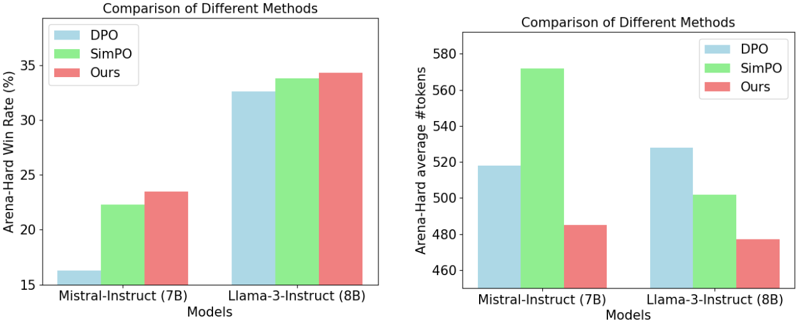

# Length-Controlled Margin-Based Preference Optimization without Reference Model

Official implementation for the paper titled "Length-Controlled Margin-Based Preference Optimization without Reference Model".

</img>

## Install Requirements

Our codebase is built upon the [alignment-handbook repo](https://github.com/huggingface/alignment-handbook). The following steps will guide you through the installation process.

First, create a Python virtual environment using e.g. Conda:
```shell
conda create -n handbook python=3.10 && conda activate handbook
```

Next, install PyTorch `v2.2.2`. Since this is hardware-dependent, we
direct you to the [PyTorch Installation Page](https://pytorch.org/get-started/locally/).

You can then install the remaining package dependencies of [alignment-handbook](https://github.com/huggingface/alignment-handbook) as follows:

```shell
git clone https://github.com/huggingface/alignment-handbook.git
cd ./alignment-handbook/
python -m pip install .
```

You will also need Flash Attention 2 installed, which can be done by running:

```shell
python -m pip install flash-attn --no-build-isolation
```

## Training Scripts

We provide four training config files for the four training setups reported in our paper. The training config is set for 4xA100 GPUs. You may need to adjust `num_processes` and `per_device_train_batch_size` based on your computation environment. 


* Mistral-Base:
```shell
ACCELERATE_LOG_LEVEL=info accelerate launch --config_file accelerate_configs/deepspeed_zero3.yaml scripts/run_lmpo.py training_configs/mistral-7b-base-lmpo.yaml
```
* Mistral-Instruct:
```shell
ACCELERATE_LOG_LEVEL=info accelerate launch --config_file accelerate_configs/deepspeed_zero3.yaml scripts/run_lmpo.py training_configs/mistral-7b-instruct-lmpo.yaml
```
* Llama3-Base:
```shell
ACCELERATE_LOG_LEVEL=info accelerate launch --config_file accelerate_configs/deepspeed_zero3.yaml scripts/run_lmpo.py training_configs/llama-3-8b-base-lmpo.yaml
```
* Llama3-Instruct:
```shell
ACCELERATE_LOG_LEVEL=info accelerate launch --config_file accelerate_configs/deepspeed_zero3.yaml scripts/run_lmpo.py training_configs/llama-3-8b-instruct-lmpo.yaml
```

## Acknowledgement
The project is built upon [SimPO](https://github.com/princeton-nlp/SimPO).
